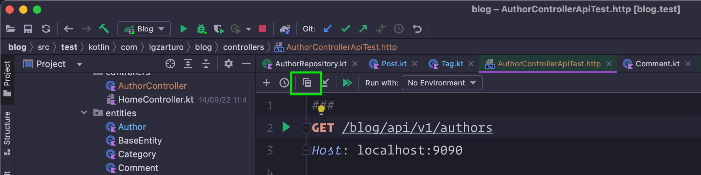
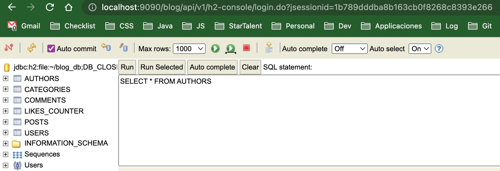
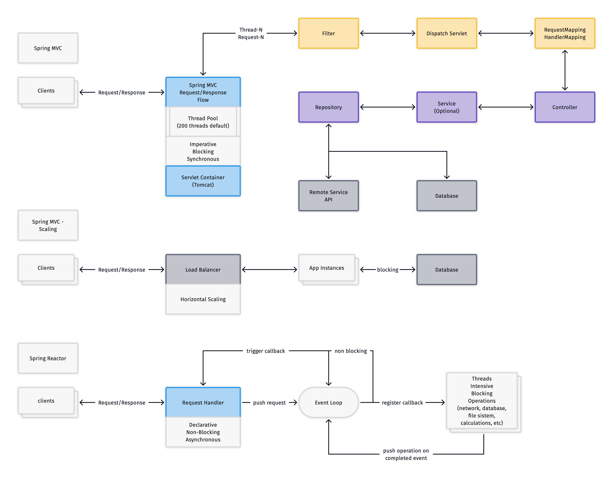

# Blog

Ejemplo de API Rest Blog con Spring Boot 2.7.5 + Kotlin + Gradle + Java 17

> El objetivo es que pueda servir como guía para el aprendizaje, lo más importante será histórico de Git, así como los ejemplos propuestos de la estructura y buenas prácticas al diseñar una Api Rest

## Proyecto

Plantilla para crear el proyecto desde la página de start.spring.io

> https://start.spring.io/#!type=gradle-project&language=kotlin&platformVersion=2.7.5&packaging=jar&jvmVersion=17&groupId=com.lgzarturo&artifactId=demo&name=demo&description=API%20Rest%20Blog%20con%20Spring%20Boot%202.7.5%20%2B%20Kotlin%20%2B%20Gradle%20%2B%20Java%2017&packageName=com.lgzarturo.demo&dependencies=devtools,configuration-processor,web,validation,data-jpa

### Estructura del proyecto

- **configurations**: Se definen los estereotipos @Configuration para personalizar los recursos de la aplicación.
- **controllers**: Capa con los controladores de la aplicación de tipo RestFul.
- **entities**: Capa para la representación de las tablas en JPA.
- **exceptions**: Se especifican las excepciones para el control de respuesta del API Rest.
- **models**: Capa para representar los datos que responde la aplicación.
- **repositories**: Capa con el acceso a datos, mediante interfaces de repositorios.
- **security**: Se puede usar para definir los beans y las configuraciones de seguridad.
- **services**: Capa de servicios para el procesamiento de las reglas de negocio.

### Casos de uso

El Api debe soportar tres tipos de usuarios, uno de tipo administrador, uno de tipo autor y un visitante.

### Pruebas

En el paquete `test.kotlin.com.lgzarturo.blog` se podrán encontrar archivos con la extension `*.http`, se pueden usar para hacer consultas en los endpoints, el Intellij IDEA Ultimate tiene de forma nativa un plugin que soporta estos archivos realizar solicitudes http y ofrece un método para generar la versión curl de cada endpoint.

**Ejemplo**
- Abrir el archivo: AuthorControllerApiTest.http
- Posicionar el cursor en el método que queremos exportar
- Dar clic en el botón `Convert to Curl and Copy`
- Ahora la instrucción en formato Curl estará en el Clipboard y la podemos pegar en cualquier cliente Rest como Postman.

#### Administrador

- Registrar un autor en el blog
- Administrar a los usuarios del blog
- Crear categorías
- Publicar, crear, editar y borrar artículos
- Aprobar comentarios
- Aprobar la publicación de artículos

#### Autor

- Ver una publicación
- Dar me gusta a una publicación
- Escribir artículos
- Responder a comentarios

#### Visitante

- Ver publicaciones de los autores
- Filtrar contenido por autor y categoría
- Dar me gusta a una publicación
- Escribir comentarios en una publicación
- Dar me gustar a un comentario

### Base de datos

- **users**: Se usa para guardar el registro y credenciales de acceso de los usuarios.
- **authors**: Mantiene una tabla de autores registrados en el blog.
- **posts**: Almacena la información necesaria para los artículos.
- **categories**: Define las categorías para organizar los artículos.
- **comments**: Se llena con los comentarios de los usuarios.
- **likes_counter**: Define el número de "me gusta" que tiene un artículo.

### Estructura de datos

#### Tabla `authors`

> Entidad Author.kt

- id - Long(PK)
- name - String(90)
- avatarImage - String(255)
- description - String(1000)
- posts -> `author_id`(relationship)
- createdAt - LocalTimeDate
- updatedAt - LocalTimeDate

#### Tabla `categories`

> Entidad Category.kt

- id - Long(PK)
- title - String(180)
- slug - String(180)
- description - String(1_000)
- posts -> `category_id`(relationship)
- createdAt - LocalDateTime
- updatedAt - LocalDateTime

#### Tabla `comments`

> Entidad Comment.kt

- id - Long(PK)
- parentComment `parent_id`(relationship) - Long
- post -> `post_id`(relationship) - Long
- author - String(90)
- authorEmail - String(255)
- ipAddress - String(100)
- content - String(1_000)
- isApproved - Boolean
- commentLikes - Long
- createdAt - LocalDateTime
- updatedAt - LocalDateTime

#### Tabla `likes_counter`

> Entity LikeCounter.kt

- id - Long(PK)
- contentType - String(10)
- contentId - Long
- likesNumber - Long
- createdAt - LocalDateTime
- updatedAt - LocalDateTime

#### Tabla `posts`

> Entity Post.kt

- id - Long(PK)
- parentPost -> `parent_id`(relationship) - Long
- title - String(180)
- slug - String(180)
- coverImage - String(255)
- summary - String(1_000)
- content - String(65_535)
- status - String(20)
- postType - String(20[PAGE|ARTICLE|PHOTO|VIDEO|GALLERY])
- postLikes - Long
- postComments - Long
- comments -> `comment_id`(relationship) - Long
- hasPage - Boolean
- menuOrder - Integer
- author -> `author_id`(relationship)
- category -> `category_id`(relationship)
- publishedAt - LocalDate
- tags -> `tag_id`(relationship)
- createdAt - LocalDateTime
- updatedAt - LocalDateTime

#### Tabla `users`

> Entity User.kt

- id - Long(PK)
- email - String(255)
- password - String(255)
- userType - String(20[ADMIN|AUTHOR|USER])
- enabled - Boolean
- isActive - Boolean
- verification - Long
- author - `author_id`(relationship) - Long
- authorities - `role_id`(relationship) - Long
- createdAt - LocalTimeDate
- updatedAt - LocalTimeDate

#### Tabla `tags`

> Entity Tag.kt

- id - Long(PK)
- name - String(255)
- slug - String(255)
- posts - `post_id`(relationship) - Long
- createdAt - LocalTimeDate
- updatedAt - LocalTimeDate

#### Tabla `roles`

> Entity Tag.kt

- id - Long(PK)
- authority - String(255)
- createdAt - LocalTimeDate
- updatedAt - LocalTimeDate

### Diagrama del schema

## Reactor WebFlux

Se integran las librerías de WebFlux y reactor para realizar pruebas con la aplicación el objetivo es dominar el asincronismo en Java.

> WebFlux se menciona como una solución para el escalamiento donde las aplicaciones basadas en Spring Boot no requieren el uso de un hilo de ejecución por cada sesión de usuario.

## Documentación

- [Ideas para construir una REST API](docs/api-rest.md)
- [Dependencias básicas para Spring Boot](docs/spring-boot-dependencies.md)
- [Capas del proyecto y tips de programación](docs/spring-boot-project.md)
- [Actualizando a Spring Boot 2.7.5](docs/spring-boot-migration.md)
- [Configurando la base de datos H2 para desarrollo y que se persista en disco](docs/database-h2-development.md)

## Referencias

- [1]: [Listado de configuraciones de spring boot: `application.properties`](https://docs.spring.io/spring-boot/docs/current/reference/html/application-properties.html)
- [2]: [Palabras reservadas que soporta JPA para definir las consultas como métodos](https://docs.spring.io/spring-data/jpa/docs/current/reference/html/#jpa.query-methods.query-creation)
- [3]: [Apéndice de palabras que soportan los repositorios](https://docs.spring.io/spring-data/jpa/docs/current/reference/html/#repository-query-keywords)