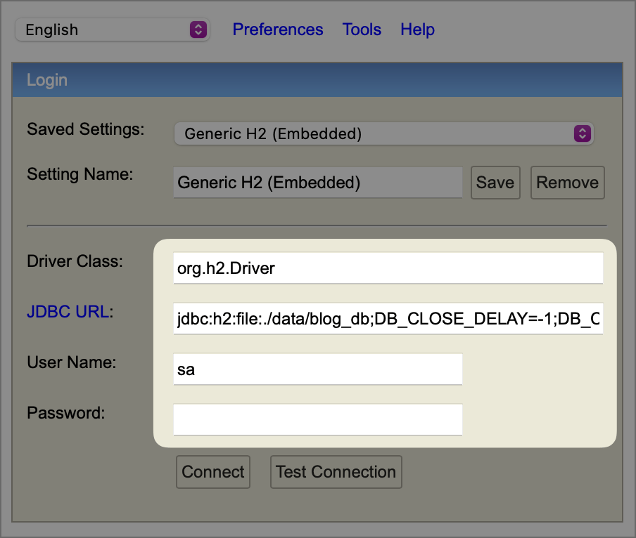
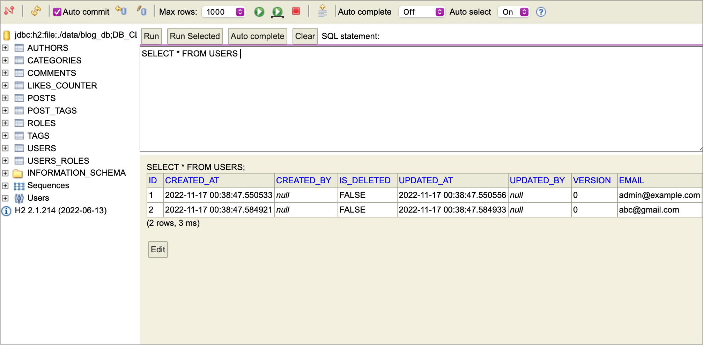

# Configuración de H2 en Spring Boot

Vamos a ver como configurar y conectar la base de datos H2 con Spring Boot, esta base de datos nos puede servir para las primeras fases del desarrollo y para realizar pruebas automatizadas, es una base de datos muy rápida, se puede mantener en memoria o persistir en disco.

## Base de datos H2

- H2 es una base de datos escrita en Java muy liviana.
- Es pequeña, simple y puede ser montada en Spring Boot para iniciar el proceso de desarrollo de un proyecto. 
- La base de datos no requiere instalación, complejas configuraciones o servicios adicionales para administrar la base de datos.
- La base de datos puede ser usada en memoria, es muy util para pruebas en las fases del desarrollo.
- Es una base de datos muy rápida y liviana, está escrita en Java y soporta el estándar de SQL.
- Por conveniencia no es recomendada para entornos productivos.

## Dependencias

Para usar la base de datos H2 con Spring Boot solo necesitamos definir 2 dependencias en el archivo de `build.gradle.kts`

```gradle
implementation("org.springframework.boot:spring-boot-starter-data-jpa")
runtimeOnly("com.h2database:h2")
```

## Configuración

En el archivo de configuración de la aplicación `application.properties` es necesario definir las siguientes propiedades:

```properties
spring.h2.console.enabled=true
spring.datasource.url=jdbc:h2:file:./data/blog_db;DB_CLOSE_DELAY=-1;DB_CLOSE_ON_EXIT=False;AUTO_RECONNECT=TRUE
spring.datasource.driverClassName=org.h2.Driver
spring.datasource.username=sa
spring.datasource.password=
spring.jpa.database-platform=org.hibernate.dialect.H2Dialect
```

> La url de conexión está especificando que la base de datos se persista en disco `h2:file:./data/blog_db`. Para que la base de datos sea usada en memoria hay que especificar lo siguiente `h2:mem:blog_db` 
> 

## Consola de H2

La base de datos de H2 provee de una conveniente consola para administrar los datos, con ella podemos ver el esquema, las tablas y los datos.

Esta consola está deshabilitada, es necesario especificar la siguiente propiedad `spring.h2.console.enabled=true` para habilitarla.

Para usar la consola solo es necesario especificar en la url el recurso `/h2-console`

Ejemplo usando el puerto `8080` y el contexto `/`:

http://localhost:8080/h2-console



> Para poder acceder a los datos es necesario especificar la cadena de conexión JDBC url y las credenciales, estos datos los podemos obtener del archivo de propiedades de proyecto `application.properties`

